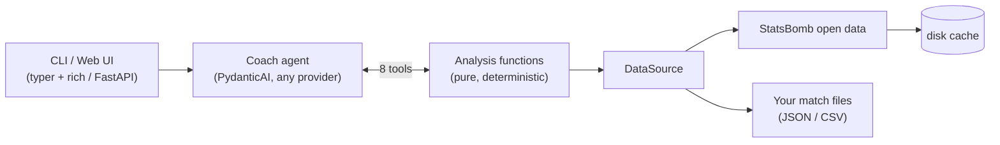

# ⚽ gaffer

**An AI soccer coach grounded in real match data.** Ask tactical questions about
real matches; the LLM coaches, deterministic tools compute the stats — so the
numbers are never hallucinated. Works with **Anthropic, OpenAI, Google, or a
fully local Ollama model** — switch providers with one string.

[](https://github.com/Viraj0518/gaffer/actions/workflows/ci.yml)
[](LICENSE)
[](pyproject.toml)

```text
you › How did Argentina create chances in the 2022 final?

  ⚙ list_matches(Argentina)
  ⚙ shot_stats(3869685)
  ⚙ passing_stats(3869685, Argentina)

coach › Argentina generated 2.76 xG from 20 shots — and the passing data shows
        how: Enzo Fernández (94 passes) was the metronome, with the
        Fernández → Mac Allister lane their most-used route into the final
        third. Messi's 5 shots produced 1.46 xG...
```

## Why this exists

Most "AI sports analysis" is a language model confidently making numbers up.
gaffer takes the opposite bet:

- **The LLM coaches, tools compute.** Every statistic comes from a
  deterministic function over real event data, exposed to the agent as a tool.
  The model's job is what it's actually good at: interpretation, tactics,
  communication.
- **Provider-agnostic by construction.** Built on
  [PydanticAI](https://ai.pydantic.dev), the model is just a string:
  `anthropic:claude-sonnet-5`, `openai:gpt-5`, `google-gla:gemini-2.5-flash`,
  `ollama:llama3.2`. No cloud account required — it runs fully local.
- **Real data out of the box, your data when you want.**
  [StatsBomb open data](https://github.com/statsbomb/open-data) (World Cup
  2022 by default, dozens of competitions available) plus a
  [documented schema](docs/byo-data.md) for loading your own team's matches.

## Quickstart

### A. Fully local (no API key)

```bash
# needs: uv (https://docs.astral.sh/uv) and ollama (https://ollama.com)
ollama pull llama3.2
uv tool install git+https://github.com/Viraj0518/gaffer
coach chat -m ollama:llama3.2
```

### B. Cloud provider

```bash
uv tool install git+https://github.com/Viraj0518/gaffer
export ANTHROPIC_API_KEY=sk-ant-...
coach chat                        # default model: anthropic:claude-sonnet-5
```

### C. From a clone

```bash
git clone https://github.com/Viraj0518/gaffer && cd gaffer
uv sync
uv run coach matches              # no LLM needed — browse the data first
uv run coach chat --verbose      # see the tool calls as they happen
```

### Commands

| Command | What it does |
|---|---|
| `coach chat` | interactive chat with the coach (streaming, markdown) |
| `coach ask "..."` | one-shot question, scriptable |
| `coach serve` | local web UI at http://localhost:8000 |
| `coach matches` | list available matches — works without any API key |
| `coach cache info\|clear` | manage the local data cache |

Every command takes `-m/--model` and `--data-dir`.

## Picking a model

Precedence: `--model` flag → `COACH_MODEL` env var → default.

| Provider | Model string | Needs |
|---|---|---|
| Anthropic (default) | `anthropic:claude-sonnet-5` | `ANTHROPIC_API_KEY` |
| OpenAI | `openai:gpt-5` | `OPENAI_API_KEY` |
| Google | `google-gla:gemini-2.5-flash` | `GEMINI_API_KEY` |
| Ollama (local) | `ollama:llama3.2` | nothing (`OLLAMA_BASE_URL` to override) |
| anything else PydanticAI supports | `groq:...`, `mistral:...`, ... | provider extra: `pip install pydantic-ai-slim[groq]` |

## Architecture



The agent has eight tools — deliberately few, composable, and fact-shaped:

| Tool | Returns |
|---|---|
| `list_matches` | ids, teams, scores, dates — how the model resolves "the final" |
| `get_match` | lineups, formations, goal timeline, subs, shootout result |
| `possession_stats` | possession %, pass completion, final-third entries |
| `shot_stats` | shots, on-target, goals, xG + per-shot list |
| `passing_stats` | top passers, pass pairs, progressive passes |
| `defensive_stats` | tackles, interceptions, pressures, blocks + busiest defenders |
| `player_match_stats` | one player's full line (fuzzy name matching) |
| `team_form` | W/D/L + xG for/against over recent matches |

Design details worth stealing:

- **`ModelRetry` as UX**: a typo'd team/player name doesn't error — the tool
  raises a retry with the valid options, and the model corrects itself.
- **Shootouts don't pollute stats**: penalty-shootout attempts are excluded
  from shot/xG numbers (the 2022 final reports 3 goals, not 7).
- **Tests never touch a network or an LLM**: parsing is tested against a
  vendored fixture; the agent is tested with PydanticAI's `FunctionModel`;
  `ALLOW_MODEL_REQUESTS = False` makes it a hard guarantee.

## Your own team's data

Drop your matches in a directory (JSON or CSV events), point `--data-dir` at
it, and the coach analyzes your games exactly like World Cup finals. Schema
and examples: **[docs/byo-data.md](docs/byo-data.md)**.

## Roadmap

- kloppy adapter (Opta / Wyscout / tracking-data providers)
- `coach plot` — pass networks and shot maps via mplsoccer
- season-long scouting reports
- xT / OBV-style possession-value metrics
- PyPI release

## Data attribution

Match data from the [StatsBomb open data](https://github.com/statsbomb/open-data)
repository, used under its non-commercial license — please attribute StatsBomb
in anything you build from it, and read their license terms.

## License

MIT © Viraj Sharma
